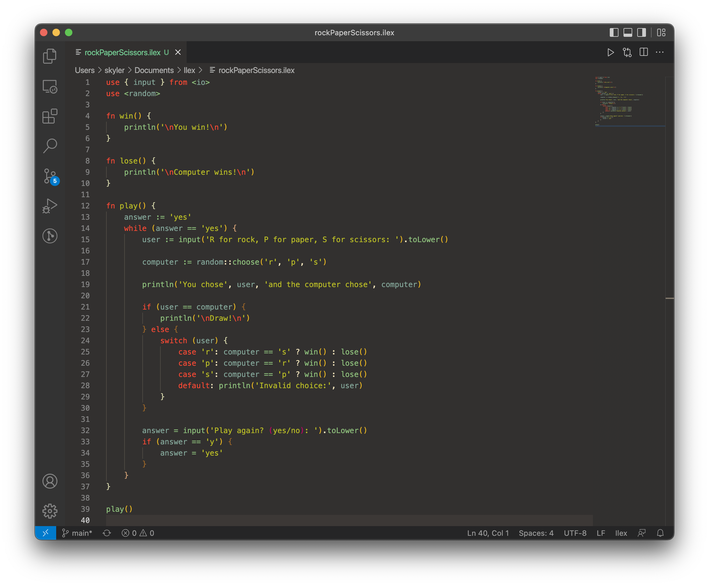

# ilex-lang README

Ilex is a high-level statically (TODO) typed programming language. It has a familiar c++/go/typescript-like syntax with inspiration from other languages such as Python and Ruby.

The main goal of Ilex is to be easy to use and make development quicker. Ilex strives for adequacy and will settle for nothing less (eventually).

See https://atsoteck.github.io/ilex-lang/ for more info.

## Features

Adds syntax highlighting for the Ilex scripting language to Visual Studio Code.

## Known Issues

No intellisense yet.

## Release Notes

Ilex scripting language syntax highlighting first release. For Ilex version 0.0.60.

### 0.0.3

First release, for Ilex version 0.0.60.
